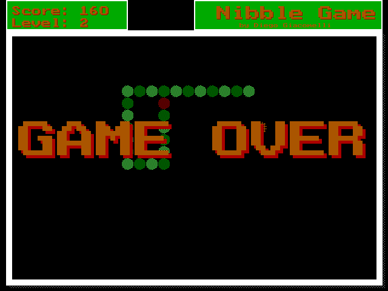

Nibble
======
Yet another small nibble game. 
This was one of first games that I have made.

Language
===
I programmed it using C on Turbo C, more than 10 years ago. 

The entire HUD was made using the BGI ([Borland Graphic Interface](http://en.wikipedia.org/wiki/Borland_Graphics_Interface))

Code philosophy
===
There is no code philosophy, I was learning how to programming, so, the code is very basic and was written in portuguese.

The whole game logic is inside the [NIBBLE.C](src/NIBBLE.C) file (461 loc).

How to run?
===

1. This games is for DOS, so you will need to install [DOSBox](http://www.dosbox.com/download.php?main=1).
2. Download the [Nibble.zip](build/NIBBLE.zip) file, unzip it on a folder, like c:\nibble.
3. Open DOSBox
4. Type mount c c:\nibble
5. Type c
6. Type nibble.exe
7. Enjoy! 

How to play?
===
Do you don't know how to play a nibble game? Well, in this case you don't know how  to run it too. Nevermind! ;)

How to improve it?
======

- Create a fork of [Nibble](https://github.com/giacomelli/Nibble/fork). 
- Did you change it? [Submit a pull request](https://github.com/giacomelli/Nibble/pull/new/master).

License
======

Licensed under the The MIT License (MIT).
In others words, you can use this code in any kind of software: open source, commercial, proprietary and alien.

Change Log
======
 - 1.0 The first and, probably, last version.
